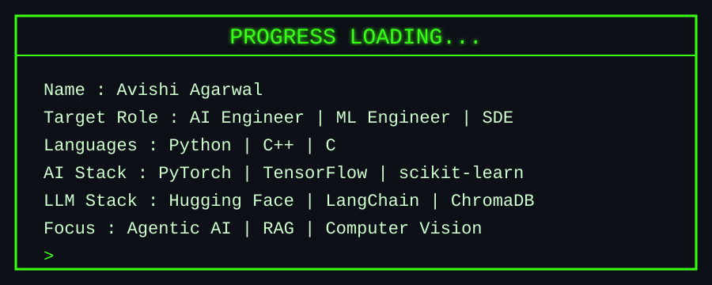

<p align="center">
  
</p>

<p align="center">
  <b>AI/ML Researcher | SDE | Developer</b>
</p>


<p align="center">
  
  
  
  
  
  
</p>

<p align="center">
  
</p>

<p align="center">

</p>

<p align="center">
  
</p>

<p align="center">
  
</p>

Tech Arsenal

<p align="center">
  
</p>

<p align="center">
  
  
  
  
  
  
  
  
  
  
  
</p>


##  &nbsp; Work Experience

### 🔬 Research Intern &nbsp;·&nbsp; Delhi Technological University
**`June 2026 – August 2026`** &nbsp;|&nbsp; 📍 New Delhi, India

```text
📌 Working on provenance-preserving memory systems for long-running AI agents
```

- 🧠 Developed **PPGC (Provenance-Preserving Graph Consolidation)** for compressing and consolidating agent memory while retaining source provenance
- 📊 Evaluated **5 memory strategies across 20 conversations**, achieving **100% provenance precision** and **87.3% relevant-information recall**
- 🗜️ Reduced stored memory by **24.6%** while preserving information required for downstream retrieval
- 🧪 Validated an **LLM-based evaluation framework** against 57 human-labelled assessments, achieving **94.7% agreement** and **Cohen’s κ = 0.895**

**Stack:** `Python` `LLMs` `Knowledge Graphs` `RAG` `Ollama` `Graph Consolidation` `LLM Evaluation`


##  &nbsp; Featured Projects

<div align="center">
<table>
<tr>
<td width="50%" valign="top">

### 🛰️ [AI NOC Copilot](https://github.com/aarush-dev/mpls-lab)

Air-gapped **predictive AI copilot for secure MPLS network operations**, built for the **ISRO Bharatiya Antariksh Hackathon 2026**.

- 🌐 Built over a **148-container SD-WAN/MPLS topology** with SNMP, Syslog, NetFlow/IPFIX & BGP/OSPF telemetry
- 🧠 Multi-model pipeline combining **PatchTST, ST-GNN, VAE + Clustering & meta-learning**
- ⚠️ Simulated **21 cascading network fault scenarios** with failure forecasting and time-to-impact estimation
- 🔎 Offline topology-aware **RAG Copilot** using knowledge graphs, runbooks, telemetry & incident history


</td>
<td width="50%" valign="top">

### 🛡️ [WomenSafe — Graph-Based Urban Safety](https://github.com/avishi-dev/women-safe-route)

Graph-based urban safety prediction system using **Graph Attention Networks** to estimate road-level safety across a city.

- 🗺️ Constructed a city-scale road graph from heterogeneous **geospatial data**
- 🧠 Developed a **2-stage GAT pipeline** for feature completion and road safety estimation
- 💡 Integrated **crime reports, lighting infrastructure & road topology**
- 📍 Designed to predict safety even in regions with **sparse or missing observations**


</td>
</tr>

<tr>
<td width="50%" valign="top">

### 🩺 [AASHA — Offline Rural Health Assistant](https://github.com/Sarthakcodes007/Curebay)

Edge-native AI healthcare assistant built for the **AIC-CureBay Hackathon at APOGEE 2026, BITS Pilani**.

- 📱 Integrated **medical triage, patient screening & prescription digitisation** for zero-connectivity environments
- 🗣️ Built an **offline multilingual voice-first LLM pipeline** supporting English & Hindi
- 📄 Integrated OCR for digitising handwritten prescriptions
- 🧠 Combined **audio + computer vision models** for respiratory distress, skin-condition and anaemia screening


</td>
<td width="50%" valign="top">

### 🚀 More on GitHub →

Explore my repositories spanning **AI/ML research, graph learning, agentic systems, computer vision, network intelligence and software projects**.

```diff
+ AI/ML & Deep Learning
+ Graph Neural Networks & Geospatial AI
+ Agentic Memory & RAG Systems
+ Predictive Network Intelligence
+ Computer Vision & Multimodal AI
+ DSA & Software Development
```

<div align="center">

[](https://github.com/avishi-dev?tab=repositories)

</div>

</td>
</tr>
</table>
</div>


Let's Connect
<p align="center"> <a href="https://www.linkedin.com/in/avishi-agarwal21/">  </a> 
  </a>  
</p>
<!-- Modern Footer -->
<div align="center">  </div>
